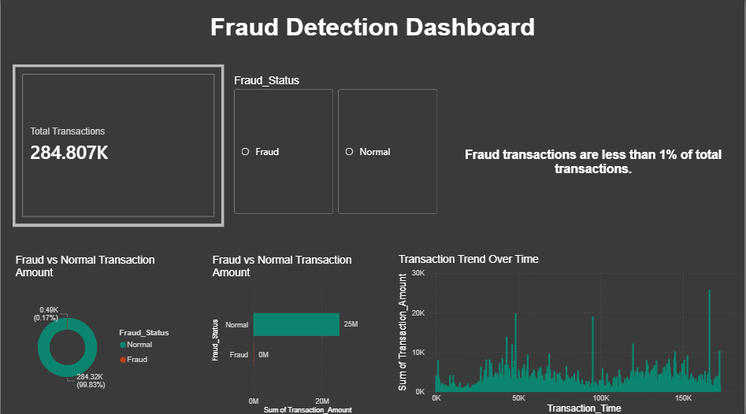

# Fraud Detection Dashboard (Power BI)

## 📊 Power BI File
[Download PBIX](https://drive.google.com/file/d/1_r9sciZ7eefWr__mXxqPKnGxAFIdxZUr/view?usp=sharing)

---

## 📁 Dataset
[Download Dataset](https://drive.google.com/file/d/1v0M_ebzVC0hy47XBlqb8g4NEs0dy6yCr/view?usp=sharing)

---

## 📊 Overview
This project analyzes credit card transactions to identify fraud patterns using Power BI.

---

## 🔍 Key Insights
- Fraud transactions are less than 1% of total transactions  
- Most transactions are normal  
- Time-based spikes indicate unusual activity  

---

## 🛠 Tools Used
- Power BI  
- Data Cleaning  
- Data Visualization  

---

## 📸 Dashboard Preview

